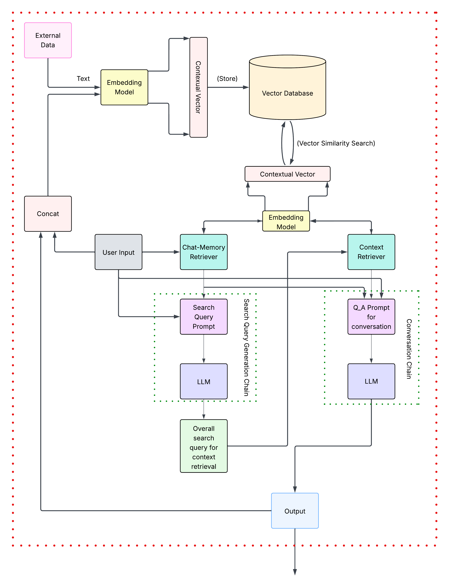
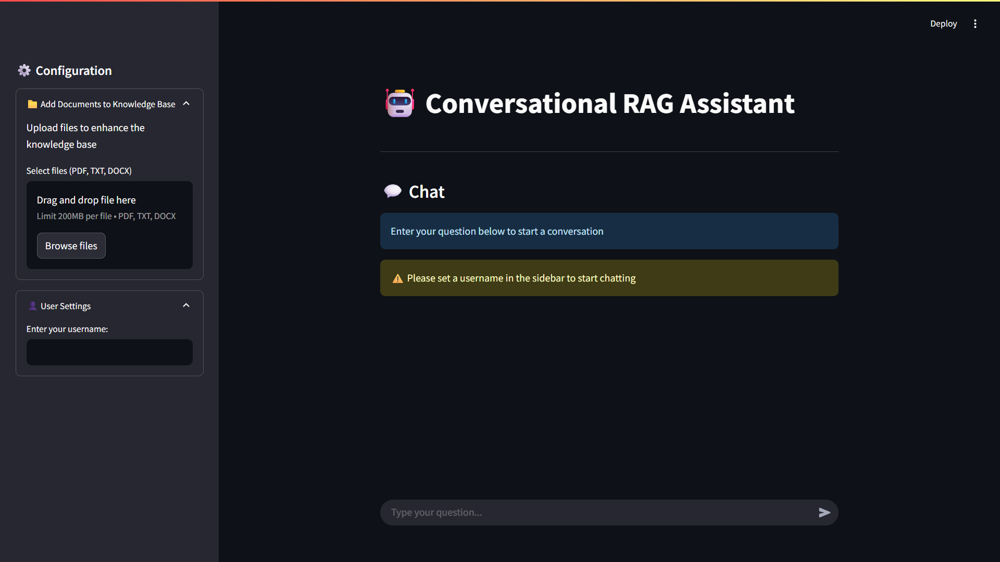

# Conversational RAG Assistant


A Streamlit-based Retrieval-Augmented Generation (RAG) chat application that merges external knowledge with conversational memory to provide accurate, context-aware responses for each user.

---

## Table of Contents

1. [Project Overview](#project-overview)
2. [Architecture & Workflow](#architecture--workflow)
3. [Demo Interface](#demo-interface)
4. [Features](#features)
5. [Installation](#installation)
6. [Usage](#usage)
7. [Configuration](#configuration)
8. [File Structure](#file-structure)
9. [Contributing](#contributing)
10. [License](#license)

---

## Project Overview

The **Conversational RAG Assistant** leverages large language models (LLMs) and vector search to:

- **Ingest external documents** (PDF, TXT, DOCX) and convert them into embeddings
- **Store embeddings** in a vector database for semantic retrieval
- **Retrieve relevant context** from both uploaded documents and past conversation memories
- **Refine queries** via an LLM-based search-prompt chain
- **Generate responses** through a conversational Q&A chain, personalized per user session

By combining external knowledge and chat history, this tool can answer detailed queries, recall past interactions, and adapt retrieval strategies dynamically.

---

## Architecture & Workflow



1. **External Data Ingestion**: Uploaded files are chunked and passed through an embedding model.
2. **Vector Storage**: Embeddings are stored in a vector database (e.g., Pinecone, Milvus).
3. **User Query Handling**:
   - **Memory Retriever** fetches embeddings from prior chat turns.
   - **Context Retriever** retrieves related document embeddings.
4. **LLM Chains**:
   - **Search Query Generation**: Crafts improved retrieval queries.
   - **Conversation Q&A**: Builds the final answer prompt.
5. **Response Assembly**: Concatenate retrieved snippets, memory, and user input → LLM → Display.

---

## Demo Interface



Built entirely with Streamlit, the UI allows users to:

- Upload documents (PDF, TXT, DOCX) into the knowledge base
- Enter a username to isolate session vectors
- Interactively chat with the assistant in real time


---

## Features

- **RAG-Powered Chat**: Combines external docs and memory for accurate answers
- **Dynamic Query Refinement**: LLM-assisted search prompt improves retrieval
- **User Session Isolation**: Each username corresponds to its own vector namespace
- **File Upload Support**: Handles files up to 200MB in common formats
- **Modular Components**: Easily swap embedding models, vector stores, and LLMs

---

## Installation

1. **Clone the repository**

   ```bash
   git clone https://github.com/your-username/conversational-rag-assistant.git
   cd conversational-rag-assistant
   ```

2. **Create and activate a virtual environment**

   ```bash
   python3 -m venv venv
   source venv/bin/activate
   ```

3. **Install dependencies**

   ```bash
   pip install -r requirements.txt
   ```

4. **Set up environment variables**

   ```bash
   cp .env.example .env
   # Edit .env with your API keys and DB credentials
   ```

---

## Usage

1. **Launch the Streamlit app**

   ```bash
   streamlit run app.py
   ```

2. **Open** the URL printed in the console (typically `http://localhost:8501`).

3. **Upload your documents**, enter a username, and start chatting!

---

## Configuration

- **Environment Variables** (`.env`):

  - `OPENAI_API_KEY` – Your OpenAI key
  - `VECTOR_DB_URL`  – Your vector database endpoint
  - `EMBEDDING_MODEL` – Embedding model identifier
  - `LLM_MODEL`      – Chat model identifier

- **Settings** (`config.py`): Customize chunk size, overlap, namespaces, LLM options, etc.

---

## File Structure

```
├── .github/                 # GitHub workflows and issue templates
├── ml_project.egg-info/     # Packaging metadata
├── notebooks/               # Jupyter notebooks and experiments
├── src/                     # Core application modules
│   ├── components/          # Chains, models, prompts, retrievers
│   ├── vector_db_store/     # Vector database client wrapper
│   ├── __init__.py
│   └── session.py           # User session & namespace logic
├── app.py                   # Streamlit application entrypoint
├── template.py              # Code templates or utilities
├── setup.py                 # Package installation script
├── requirements.txt         # Python dependencies
├── .env.example             # Sample environment variables
├── .gitignore               # Files & folders to ignore
└── README.md                # Project documentation

---

## Contributing

Contributions are welcome:

1. Fork and create a branch (`git checkout -b feat/YourFeature`).
2. Commit improvements (`git commit -m "feat: ..."`).
3. Push to your fork (`git push origin feat/YourFeature`).
4. Open a Pull Request against `main`.

Please follow [Conventional Commits](https://www.conventionalcommits.org/) guidelines.

---

## License

This project is not licensed. All rights reserved by the author. If you wish to use or contribute, please contact the repository owner for permissions.

```